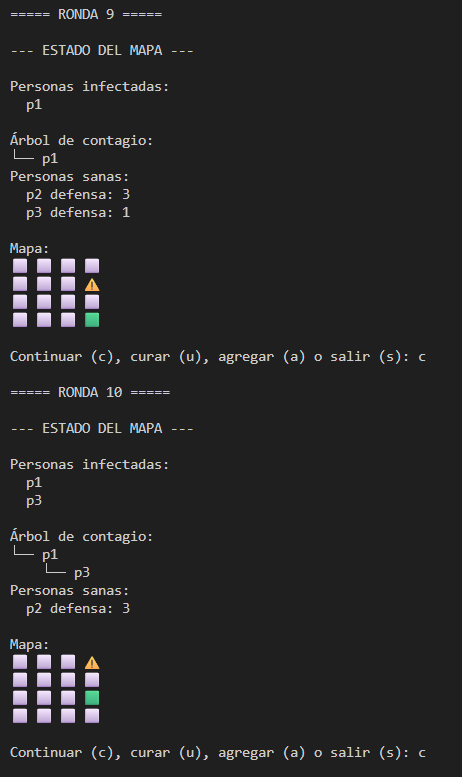
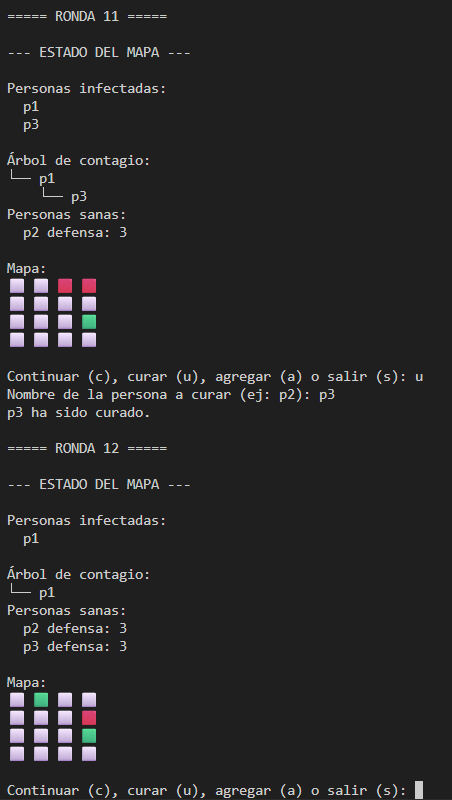
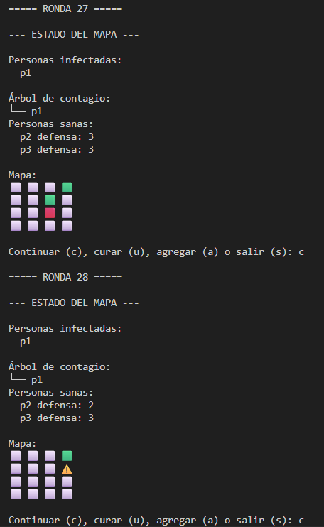
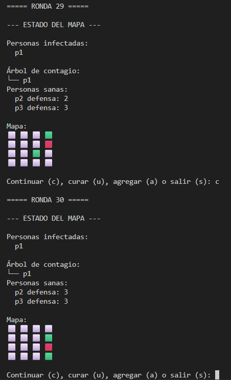
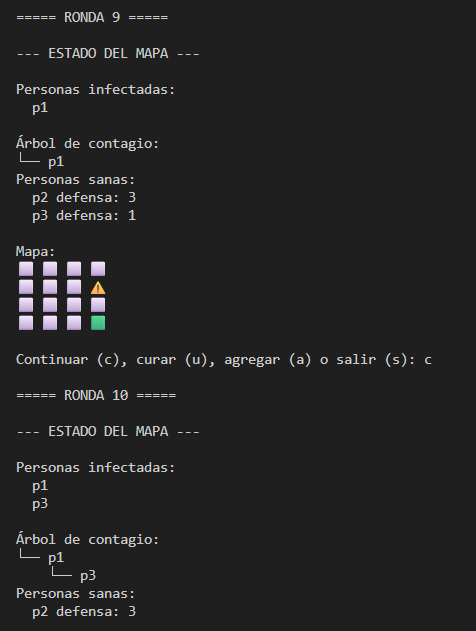

# Resident Evil UDEM  
### Simulación de propagación de infección en una matriz con árbol de contagio  
**Archivo principal:** `simulacion.py`  
**Desarrollado por:** `Mateo Molina Gonzalez & Manuel Gutierrez Villegas`  

---

## 📝 Descripción del proyecto  

Este proyecto implementa una **simulación de contagios** en un entorno representado por una matriz cuadrada.  
Cada celda puede estar ocupada por personas sanas o infectadas, las cuales se mueven aleatoriamente y pueden contagiar a otras al coincidir en la misma posición.  

El sistema mantiene un **árbol de contagio** que registra quién contagió a quién, permitiendo visualizar las relaciones de propagación. Además, las personas sanas tienen un sistema de **defensa** que disminuye al estar expuestas a infectados y se regenera cada cierto número de rondas.  

El objetivo es observar cómo evoluciona el contagio a lo largo de las rondas, mostrando el estado del mapa, las defensas y el árbol de infecciones.  

---

## ⚙️ Cómo ejecutar la simulación  

1. Tener **Python 3.8 o superior** instalado.  
2. Guarda los archivos del proyecto con los siguientes nombres:  
   - `modelos.py`  
   - `simulacion.py`  
3. Abre una terminal o entorno de desarrollo.  
4. Ejecuta el archivo **simulacion.py** para iniciar la simulación.  

5. El programa pedirá los siguientes datos:  
   - Tamaño de la matriz (por ejemplo: `5`)  
   - Número de personas (por ejemplo: `5`)  

6. Durante la simulación, podrás elegir entre las siguientes opciones:  
   - **c** → continuar a la siguiente ronda  
   - **u** → curar una persona por nombre (ejemplo: `p2`)  
   - **a** → agregar una nueva persona (ingresando coordenadas x, y)  
   - **s** → salir de la simulación  

---

## 🧩 Estructura de clases  

### `class Persona`
Representa una persona en el mapa.  

**Atributos principales:**  
- `nombre`: identificador único (ej. p1, p2, …)  
- `x`, `y`: coordenadas en el mapa  
- `defensa`: puntos actuales de defensa  
- `defensa_max`: defensa máxima alcanzable  
- `infectado`: estado de infección  

**Métodos destacados:**  
- `mover_una_celda()`: mueve la persona aleatoriamente dentro del mapa.  
- `ajustar_posicion()`: mantiene las coordenadas dentro de los límites.  

---

### `class ArbolContagio`
Lleva el registro de quién contagió a quién mediante un diccionario.  

**Métodos destacados:**  
- `registrar_contagio(infectador, infectado)`: registra una nueva infección.  
- `eliminar_persona(nombre)`: elimina una persona del árbol.  
- `mostrar_arbol()`: imprime el árbol de contagio en formato ASCII.  

---

### `class Matriz`
Representa el mapa donde se mueven las personas.  

**Métodos destacados:**  
- `imprimir_mapa()`: muestra gráficamente el estado del mapa.  
  - 🟩 persona sana  
  - 🟥 persona infectada  
  - ⚠️ varias personas en la misma celda  
  - ⬜ celda vacía  

---

### `class Simulacion`
Coordina todo el proceso de la simulación.  

**Atributos principales:**  
- `tamaño`: tamaño del mapa.  
- `personas`: lista de todas las personas.  
- `infectados`: lista de infectados actuales.  
- `sanos`: lista de personas sanas.  
- `arbol`: instancia de `ArbolContagio` para registrar contagios.  
- `mapa`: instancia de `Matriz` para mostrar el entorno.  

**Métodos destacados:**  
- `crear_personas_iniciales()`: genera las personas en posiciones aleatorias.  
- `elegir_paciente_cero()`: selecciona el primer infectado.  
- `revisar_contagios()`: revisa y aplica contagios según posiciones.  
- `aumentar_defensa_cada_x_turnos()`: incrementa la defensa de los sanos.  
- `curar_persona()`: cura una persona infectada.  
- `agregar_persona()`: agrega una nueva persona al mapa.  
- `mostrar_estado()`: muestra el estado actual del mapa, personas y árbol de contagio.  
- `ejecutar_ronda()`: ejecuta los pasos de una ronda completa (movimiento, contagio y actualización).  

---

## 📸 Capturas de ejecución

### 🧬 Propagación progresiva  
  
Se observa la expansión de la infección a medida que avanzan las rondas.

### 💊 Curación y reparenting  
  
Muestra la recuperación de un infectado y su eliminación del árbol de contagio.

### 🛡️ Incremento y decremento de defensa  
  
  
Evidencia cómo la defensa disminuye al exponerse e incrementa por bonificación.

### 🌳 Visualización del árbol por ronda  
  
Representa las relaciones de contagio actualizadas en cada ronda.

## 🧠 Supuestos asumidos  

- Solo una persona puede ocupar una celda vacía, a menos que haya contagio.  
- Los infectados reducen la defensa de los sanos que comparten su celda.  
- Cuando la defensa de un sano llega a **0**, se contagia.  
- Los sanos recuperan defensa cada cierto número de rondas (`BONUS_INTERVALO`).  
- Los movimientos son aleatorios dentro de los límites del mapa.  
- El árbol de contagio no considera reinfecciones (una vez curado, se elimina del árbol).  
